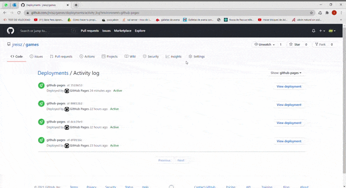

# React Minesweeper

A React clone of Minesweeper.

[Demo](https://jreisz.github.io/games)



## Development

```sh
$ git clone https://github.com/jreisz/games.git
$ cd games
$ npm install
$ npm start
```

## Contributing

Changes and improvements are more than welcome! Feel free to fork and open a pull request. Please make your changes in a specific branch and request to pull into `master`! If you can, please make sure the game fully works before sending the PR, as that will help speed up the process.

## TODO

- Multiplayer support
- Add more Unit Tests
- Improve design
- Refactoring

## License

[GNU v3.0](https://opensource.org/licenses/GPL-3.0)

Copyright (c) Juan Manuel Reisz 2021
>>>>>>> develop
